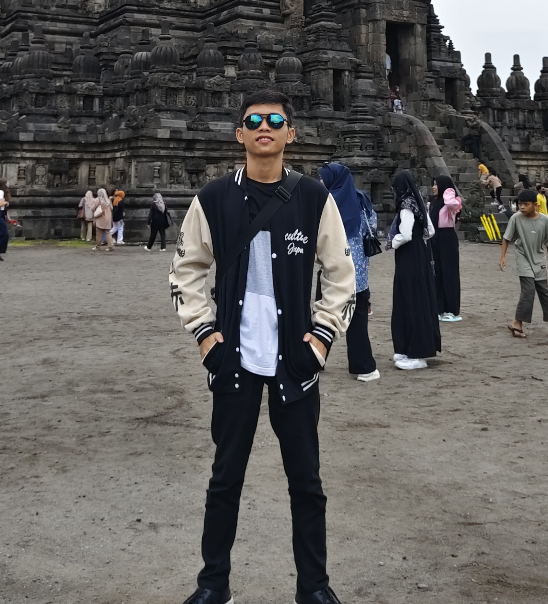

<h1 align="center">Hi👋, I'm Amos Aleksiato Ziliwu</h1>

  
  

    I'm a passionate **beginner** in web development, focusing on building my skills with **Laravel**, **JavaScript**, and other modern web technologies. I enjoy learning and applying new concepts as I grow my abilities in full-stack development.
  

### 🌟 About Me:
- 🔭 I’m currently working on: **A Flipbook Web Application** using **Laravel** and **JavaScript**.
- 🌱 I’m currently learning: **React** for front-end development and **full-stack fundamentals**.
- 📚 On my learning journey: 
  - **Front-end**: HTML, CSS, JavaScript, Bootstrap (Learning React)
  - **Back-end**: PHP (Laravel)
  - **Database**: MySQL, MariaDB
- 👯 I’m looking to collaborate on: Beginner-friendly projects, especially in **Laravel** and **web development**.
- 🛠️ I’m interested in: **Building web apps** that solve real-world problems, particularly in the education space.
  
### 💬 Ask me about:
- **Laravel**: I’m building various projects and continuously improving.
- **JavaScript basics**: As I work to master front-end and eventually back-end JavaScript.

### 📚 Projects:
- **Flipbook Web App**: A platform that allows users to read books online using a flipbook interface. (Still in progress 🚧)
- **Sambisari Coffee Online Ordering System**: An online platform for a coffee shop using a **Click and Collect** model. [Check it out here!](https://sambisaricoffee.tian.my.id/) (Completed ✅)

### 📫 How to reach me:
- **LinkedIn**: [Amos Aleksiato Ziliwu](https://www.linkedin.com/in/amos-aleksiato-ziliwu-028840293/)
- **Email**: amosaleksiatoziliwu@gmail.com

### ⚡ Fun fact:
I enjoy solving coding challenges, learning new frameworks, and experimenting with different tools to enhance my skills.
